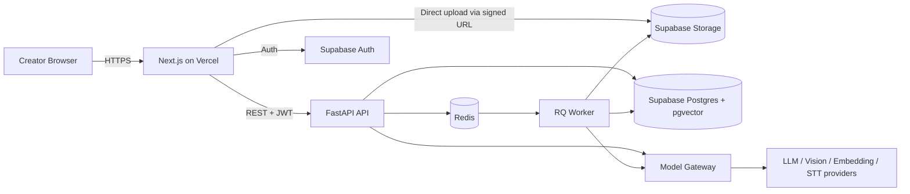
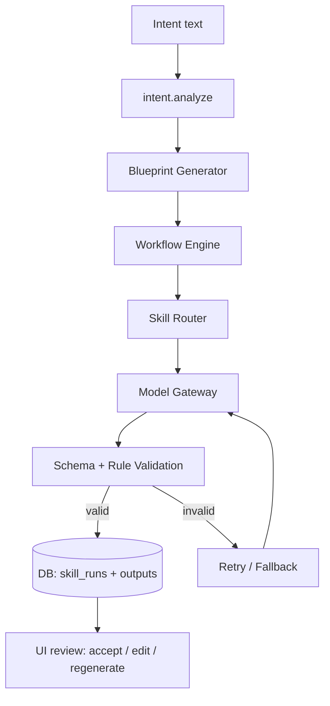
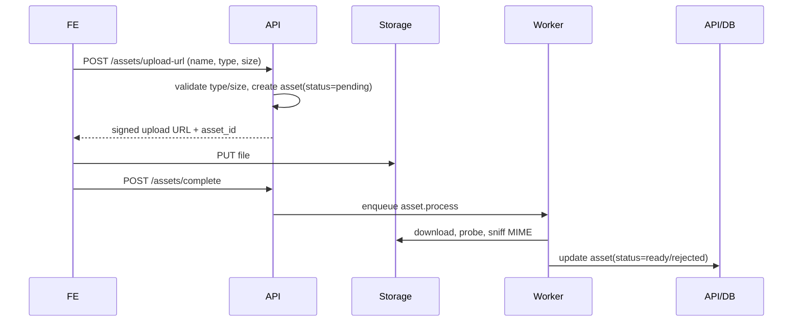
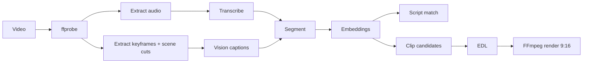
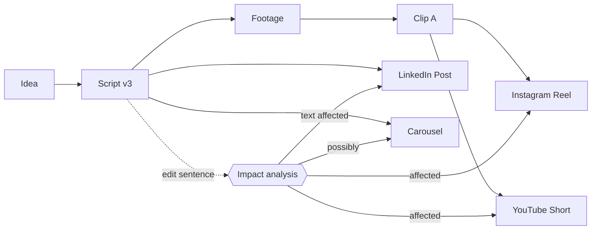

# Architecture

## 1. System Overview
Modular monolith. One FastAPI app (modules), one RQ worker process (same codebase), Supabase (Postgres+pgvector, Storage, Auth), Redis. Frontend on Vercel.



## 2. Frontend Architecture
Next.js App Router. Routes: `/` (create), `/p/[id]/intent`, `/p/[id]/blueprint`, `/p/[id]/(workspace|script|reference|shots|assets|understand|edit|genome|adapt|publish|analytics)`, `/intelligence`, `/archaeology`. Feature folders; shared `ui/` (design system). Data via TanStack Query + generated API client; Zustand only for ephemeral UI (timeline selection). Job progress via polling `GET /api/jobs/:id` (2 s).

## 3. Backend Architecture
```
backend/app/
  api/            # routers (thin)
  modules/
    intent/ blueprint/ workflow/ skills/ assets/ video/ scripts/
    references/ clips/ edits/ platform/ genome/ dna/ intelligence/ archaeology/
  ai/             # gateway, providers, prompts, schemas, evaluation
  core/           # config, auth, db, errors, logging
  workers/        # RQ job functions
```
Rules: routers call module services; modules do not import each other's internals except via service interfaces; AI calls only via `ai.gateway`.

## 4. Database Architecture
Supabase Postgres, Row Level Security on all user tables (owner = `auth.uid()`), pgvector for `asset_embeddings` / `transcript_segments`. See `DATA-MODEL.md`. Migrations via Alembic.

## 5. AI Architecture
Intent Engine → Blueprint → Workflow Engine → Skill Router → Model Gateway → Validation → DB → UI. See `AI-ARCHITECTURE.md`.



## 6. Storage Architecture
Private buckets: `assets-original`, `assets-derived` (audio, thumbnails, proxies), `renders`. Path: `{user_id}/{project_id}/{asset_id}/{filename}`. Client uploads directly with short-lived signed upload URLs; API issues signed download URLs (≤ 1 h). Metadata in Postgres; binaries only in Storage.



## 7. Job Architecture
`jobs` table (id, type, status, progress, stage, error, result_ref, attempts) mirrored by RQ. Types: `asset.process`, `video.analyze` (stages), `clips.generate`, `edit.render`, `archaeology.scan`, `genome.propagate`. Retries: 2 with backoff; idempotency key = hash(type + input ids + params). Timeouts: analyze 10 min, render 5 min.

## 8. Video Processing Architecture
See `VIDEO-PIPELINE.md`.


## 9. Content Genome & Impact Propagation

See `CONTENT-GENOME.md`.

## 10. Authentication & Authorization
Supabase Auth issues JWT; FastAPI dependency verifies signature/expiry, extracts `user_id`. Authorization: every query scoped by `owner_id`; RLS as defense in depth; storage policies by path prefix. No roles in MVP (single user per workspace).

## 11. Observability
Structured JSON logs (request_id, user_id hash, route, latency). `skill_runs` records model, tokens in/out, cost estimate, latency, status. `/api/health` and `/api/admin/metrics` (dev only) aggregate: request latency, AI latency, AI failure rate, job failure rate by type, video stage failures, workflow completion %, skill success rate. Sentry (optional) for exceptions. See `SECURITY.md` for log redaction.

## 12. Deployment
Vercel (web, env: `NEXT_PUBLIC_SUPABASE_URL`, anon key, `NEXT_PUBLIC_API_URL`). Render/Railway: `api` (uvicorn), `worker` (rq worker, FFmpeg installed via Dockerfile), Redis add-on. Supabase hosted. GitHub Actions: lint, typecheck, test, build. Demo day: keep services warm; pre-seeded demo project.

## 13. Scalability Path
Vertical first. Then: scale workers; add worker pools (video vs LLM); presigned multipart uploads; CDN for renders; move `video` to its own service; durable workflow engine (Temporal) if flows become long-lived; read replicas.
